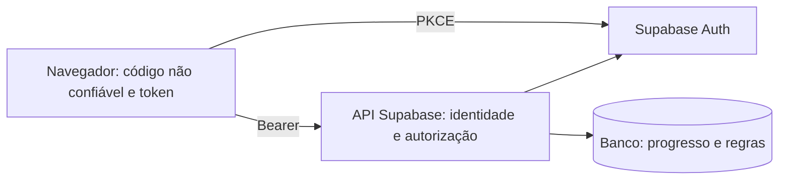
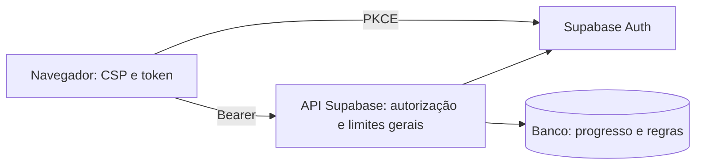
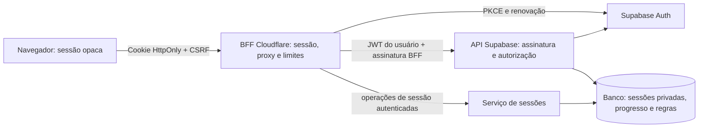

# Security Hardening Proposal: sessão, proxy e BFF

## Decision

Precisamos definir quem pode acessar tokens e quais controles são obrigatórios em cada requisição. O BFF é um backend voltado à interface, executado no servidor. Colocar regras em React ou no proxy de desenvolvimento do Vite não cria uma fronteira de segurança em produção.

## Executive Recommendation

Comparamos **Opção 1 — SPA com controles reforçados** e **Opção 2 — BFF com sessão opaca e proxy restrito**. Recomendo a Opção 2 para reduzir o acesso do JavaScript aos tokens, mantendo as verificações de usuário e recurso na API. A Opção 1 exige menos operação e pode ser adotada se a cota ou a complexidade da sessão no servidor inviabilizarem o BFF gratuito.

## Evidence

Inspecionei os arquivos abaixo. O ponto que mais influencia a recomendação é a combinação de token disponível ao navegador e ausência de uma credencial que identifique o proxy na API. Não encontrei nem executei uma exploração XSS; a exposição descrita é uma propriedade da arquitetura, não um incidente confirmado.

| Evidence | Finding or document                                 | What it establishes                                                                                                                             |
| -------- | --------------------------------------------------- | ----------------------------------------------------------------------------------------------------------------------------------------------- |
| E1       | `src/main.tsx` — cliente Auth                       | Observado: cliente Supabase no navegador, PKCE, `getSession` e renovação gerenciada pelo SDK.                                                   |
| E2       | `src/lib/gateway.ts` — transporte                   | Observado: o código da interface lê `access_token` e envia Bearer diretamente à API.                                                            |
| E3       | `supabase/functions/api/index.ts` — entrada         | Observado: CORS de origem exata, `no-store`, autenticação e convite; não exige assinatura BFF. Requisições sem Origin seguem para autenticação. |
| E4       | `supabase/functions/_shared/db.ts` — privilégio     | Observado: identidade validada em Auth `/user`; chave de serviço usada apenas no backend.                                                       |
| E5       | `supabase/migrations/202609050001_core.sql` — banco | Observado no trecho de permissões/admissão: RLS, revogação de acesso direto e admissão serializada de convidados.                               |
| E6       | `index.html` e configuração pública                 | Observado: script inline do tema; não há arquivo `public/_headers`. Precisamos compatibilizar CSP com esse script e Monaco.                     |

## Current Design And Failure Mode

Hoje a SPA precisa possuir a sessão para chamar a API. Se um script malicioso executar na origem, ele poderá tentar obter tokens acessíveis ao cliente. Nós não devemos apresentar HttpOnly como solução completa para XSS: mesmo sem ler cookies, um script na origem ainda pode executar ações em nome do usuário.

A verificação de Origin protege o uso pelo navegador, mas um cliente HTTP pode omitir ou fabricar esse cabeçalho. Se colocarmos limites somente no proxy, chamadas diretas poderão escapar deles enquanto o backend não reconhecer o BFF. A API atual ainda exige autenticação; essa observação não significa acesso anônimo aos dados.

## Desired Invariants

- Nenhuma chave administrativa, teste oculto ou gabarito bloqueado chega ao navegador.
- Na opção BFF, nenhum access token ou refresh token aparece em localStorage, sessionStorage, HTML, URLs de retorno da aplicação ou respostas JSON ao cliente.
- Identidade, convite, propriedade do recurso e regras de economia são verificadas no servidor em todas as operações relevantes.
- Chamadas diretas à API não contornam controles atribuídos ao BFF.
- Uma sessão de outro usuário nunca pode reutilizar cache, rascunhos ou resultados privados.
- Cota esgotada ou indisponibilidade não provoca contratação automática ou punição ao aluno.

## Constraints And Non-Goals

Vamos preservar React/Vite e o backend existente. A URL e a chave pública `anon` do Supabase não são segredos; ocultá-las não substitui autorização. `user-select: none`, bloqueio de menu e ofuscação não impedem cola ou extração de conteúdo autorizado.

Este trabalho não homologa o executor, não ativa pagamentos e não promete disponibilidade ilimitada no plano gratuito.

## Before Architecture

O limite atual fica na API: o navegador possui o token, mas não deve decidir permissões. Os controles existentes de convite, propriedade e transação devem sobreviver às duas alternativas.

## Options

### Option 1: SPA com controles reforçados

Nós manteríamos o fluxo atual e acrescentaríamos limites gerais na API, CSP compatível com Monaco, política de dependências e testes de autorização entre usuários. É a alternativa de menor risco operacional: preserva SDK, renovação de sessão e contrato do gateway. Não adiciona um salto de rede.

Sua limitação é concreta: uma XSS ainda pode alcançar tokens disponibilizados ao cliente. Aumentar a proteção de scripts reduz oportunidades de injeção, mas não muda a posse da sessão. Essa opção é adequada se quisermos estabilizar o beta antes de assumir uma nova camada crítica. A reversão de uma CSP incompatível pode voltar temporariamente ao modo de relatório, sem remover autenticação ou limites.

| Change             | Before                              | After                                           | Security consequence            | Cost                              |
| ------------------ | ----------------------------------- | ----------------------------------------------- | ------------------------------- | --------------------------------- |
| Limites de entrada | Cotas específicas de execução/tutor | Limites também para sessão, leitura e rascunhos | Reduz abuso de endpoints comuns | Contadores e calibração           |
| Scripts            | Sem CSP versionada identificada     | Política testada em produção                    | Reduz superfícies de injeção    | Compatibilidade com tema e Monaco |

Os limites devem existir no backend, pois essa alternativa continua oferecendo API direta. Não podemos contabilizar a proteção de tokens como benefício desta opção.

### Option 2: BFF com sessão opaca e proxy restrito

Nós moveríamos o OAuth e a renovação para Pages Functions, sob `/auth/*`, e a interface chamaria somente `/api/*`. A sessão seria um identificador aleatório de pelo menos 256 bits em cookie `__Host-rods_session`, com `Secure`, `HttpOnly`, `SameSite=Lax`, `Path=/` e sem `Domain`. O navegador consultaria `/api/session` para dados mínimos de perfil e um token CSRF, nunca para obter tokens do Supabase.

O identificador seria armazenado como hash em uma tabela privada, com tokens cifrados por chave disponível somente ao BFF. Podemos manter essa tabela no Supabase existente e expor operações estreitas de sessão via serviço autenticado, sem entregar `service_role` ao BFF. Cada registro precisa de expiração absoluta, prazo de inatividade e versão. Propomos inicialmente 24 horas absolutas e duas horas de inatividade, sujeitas à experiência do beta. A exclusão do cookie no navegador não basta: logout deve invalidar o registro e revogar a renovação no provedor quando disponível.

A renovação precisa de compare-and-swap ou lease por sessão: duas abas não podem sobrescrever o refresh token uma da outra. Não manteríamos a sessão exclusivamente na memória de um isolate ou em um cache eventualmente consistente. Isso adiciona leituras e escritas ao banco e um salto ao caminho crítico. Nós mediríamos o custo antes de migrar todos os convidados; limitar o número de sessões ativas por usuário também limita armazenamento e abuso.

O proxy aceitaria apenas métodos e rotas conhecidos, montaria o destino a partir de configuração fixa e não seguiria redirecionamentos arbitrários. Para evitar bypass, o BFF assinaria cada chamada à API com chave dedicada, timestamp, nonce e hash do corpo. A API verificaria assinatura e replay além do JWT do usuário. A assinatura prova a origem do serviço; não concede privilégios de usuário. OAuth e saúde teriam contratos próprios, sem transformar exceções em caminhos administrativos.

Essa opção mantém o frontend estático e pode usar as cotas gratuitas existentes, mas a gratuidade depende da carga e dos limites do serviço. Um incidente no BFF interrompe operações autenticadas; devemos preservar leitura pública e rascunhos locais, sem fazer fallback automático para a API direta. Em caso de rollback, invalidaríamos as sessões BFF e exigiríamos novo login no fluxo anterior, sob uma mudança controlada e com limites mantidos na API.

| Change          | Before                      | After                                      | Security consequence                       | Cost                            |
| --------------- | --------------------------- | ------------------------------------------ | ------------------------------------------ | ------------------------------- |
| Posse de tokens | JavaScript do navegador     | BFF e armazenamento privado cifrado        | Reduz exfiltração de tokens por JavaScript | Sessão e rotação no servidor    |
| Entrada         | API pública com JWT         | Proxy restrito; API exige assinatura e JWT | Impede bypass simples dos limites do proxy | Gestão de chave e replay        |
| Cookies         | Transporte Bearer explícito | Cookie enviado pelo navegador              | Exige proteção CSRF explícita              | Token CSRF e checagem de origem |
| Falha           | Dependência direta da API   | Dependência adicional do BFF/sessões       | Falha fechada preservando editor           | Mais observabilidade e latência |

Nós ganharíamos uma fronteira clara, mas concentraríamos confiança no BFF e no serviço de sessões. A chave de assinatura e a chave de cifragem devem ter finalidades diferentes; nenhuma pode aparecer em build variables públicas ou logs.

## Comparison

As direções abaixo são inferências a partir do desenho, não resultados de benchmark.

| Dimensão       | Opção 1                                           | Opção 2                                                        | Validação                                                                |
| -------------- | ------------------------------------------------- | -------------------------------------------------------------- | ------------------------------------------------------------------------ |
| Segurança      | Melhora controles locais; mantém token no cliente | Reduz exposição do token; introduz CSRF e serviço privilegiado | XSS simulada, CSRF, IDOR e bypass direto                                 |
| Latência       | Sem novo salto; contadores podem adicionar I/O    | Mais rede e consultas de sessão                                | Comparar p50/p95, alvo proposto de acréscimo p95 ≤ 200 ms para leituras  |
| Memória        | Buffers limitados na API                          | Buffers também no proxy; estado durável fora do isolate        | Corpo máximo e concorrência, sem buffering ilimitado                     |
| Recursos       | Contadores de abuso adicionais                    | Invocações BFF, armazenamento e rotação                        | Simular 100 usuários e publicar estimativa diária, sem ativar plano pago |
| Confiabilidade | Menos componentes                                 | Sessões/rotação podem bloquear acesso                          | Falha do banco, BFF e Auth; duas abas renovando                          |
| Operação       | Mudança menor                                     | Chaves, replay, limpeza e alertas novos                        | Exercício de rotação e rastreamento por request ID                       |
| Migração       | Compatibilidade com o cliente atual               | Gateway e login mudam; exige novo login                        | Fluxo antigo e novo testados antes da troca                              |
| Ergonomia      | SDK familiar, controles distribuídos              | Contrato central, equipe precisa dominar sessão                | Revisão de rota nova deve exigir política explícita                      |
| Reversão       | Reverter políticas isoladas com cuidado           | Invalidar sessões e trocar contrato de forma controlada        | Ensaio de rollback sem expor tokens                                      |

O ganho de segurança da Opção 2 depende de remover o cliente Auth do navegador e fechar o bypass da API. Só mudar a URL das chamadas acrescenta latência sem mudar essa exposição.

## Recommendation

Recomendo a Opção 2 condicionada a testes de sessão, renovação e orçamento. Nós preservaríamos os controles da Opção 1 durante a migração. Se o armazenamento de sessão pressionar o plano Free ou a renovação não for confiável, é preferível manter a SPA reforçada enquanto resolvemos essas limitações em teste.

## Evidence Coverage And Residual Risk

| Evidência                       | Opção 1                                             | Opção 2                                           | Controle que permanece necessário                  |
| ------------------------------- | --------------------------------------------------- | ------------------------------------------------- | -------------------------------------------------- |
| E1/E2 — Auth e token no cliente | Mitiga oportunidade de injeção; exposição permanece | Endereça posse do token pelo JavaScript           | CSP, renderização segura e dependências            |
| E3 — entrada direta             | Limites ficam na própria API                        | Assinatura impede bypass do BFF                   | JWT, convite e autorização de recurso              |
| E4/E5 — backend privilegiado    | Não reduz privilégio da chave de serviço            | BFF não recebe a chave; API continua privilegiada | Privilégio mínimo e testes entre usuários          |
| E6 — HTML e cabeçalhos          | Política CSP acrescentada                           | Mesma política necessária no BFF e assets         | Hash do script de tema, workers Monaco homologados |

XSS ainda pode realizar ações usando a sessão do usuário; HttpOnly reduz leitura do segredo, não essa capacidade. Limites por IP podem afetar pessoas na mesma rede. Um administrador comprometido ou um executor inseguro não é contido automaticamente pelo BFF.

## Migration And Rollout

Primeiro nós registraríamos o comportamento atual e testaríamos limites/cabeçalhos. Depois introduziríamos BFF e sessão em ambiente separado, com conta de teste convidada. Somente após renovar, sair, revogar e recuperar rascunhos corretamente migraríamos a produção.

Na troca, remover persistência de tokens do cliente, limpar somente as chaves antigas de autenticação e preservar rascunhos. Alterar o retorno OAuth da aplicação para o endpoint do BFF; o callback GitHub para Supabase permanece próprio do provedor. Habilitar assinatura obrigatória na API de forma coordenada com o frontend. Não deixar uma exceção permanente de acesso direto.

O rollback exige invalidar sessões BFF, restaurar o cliente compatível e seu callback e manter limites no backend. Não usar falha do BFF como gatilho automático para relaxar a assinatura.

## Validation Plan

Esta é a matriz de aceite proposta. P0 bloqueia a publicação do BFF; P1 bloqueia ampliação de convites; P2 é evolução acompanhada.

| ID     | Prioridade / responsável        | Critério verificável                                                                                                                                                                                                                                  |
| ------ | ------------------------------- | ----------------------------------------------------------------------------------------------------------------------------------------------------------------------------------------------------------------------------------------------------- |
| SEC-01 | P0 / BFF                        | Tokens e segredos ausentes de storage, DOM, bundles, JSON e logs do navegador; cookie opaco com todos os atributos definidos.                                                                                                                         |
| SEC-02 | P0 / Auth                       | OAuth usa PKCE, state vinculado a transação de uso único e prazo de 10 min; rejeita state ausente, expirado, reutilizado e de outra sessão. Destino pós-login é relativo e permitido.                                                                 |
| SEC-03 | P0 / BFF                        | Renovação concorrente em duas abas não perde a sessão nem reativa token revogado; logout invalida registro; prazos verificados no servidor.                                                                                                           |
| SEC-04 | P0 / BFF                        | Escritas e logout por POST exigem Origin exata e token CSRF vinculado à sessão; rejeitar ausentes/divergentes e `Sec-Fetch-Site: cross-site`. SameSite é defesa adicional.                                                                            |
| SEC-05 | P0 / Proxy                      | Allowlist de rota+método+query; sem parâmetro URL upstream. Bloquear traversal, separadores codificados, double encoding e redirecionamentos de destino; upstream fixo.                                                                               |
| SEC-06 | P0 / API                        | Sem assinatura válida do BFF a chamada protegida falha, inclusive com JWT válido e Origin falsificada. Assinar método, caminho/query canônicos, corpo, timestamp e nonce; janela proposta 60 s, rejeição atômica de replay.                           |
| SEC-07 | P0 / API                        | Sessão A não lê nem altera rascunhos, tentativas ou submissões de B. Nenhum `userId`, XP ou papel recebido do cliente determina autorização. Convite revogado bloqueia nova ação.                                                                     |
| SEC-08 | P0 / Banco                      | Chave pública não lê tabelas privadas nem executa RPC administrativa; `service_role` ausente do BFF e do frontend; falha em filtro da API coberta por teste entre usuários.                                                                           |
| SEC-09 | P0 / Proxy                      | Limite por bytes reais do corpo, mesmo sem Content-Length; teto de envelope 2 MiB e código 256 KiB/20 arquivos continuam na API. Timeout, cancelamento e resposta máxima por rota publicados.                                                         |
| SEC-10 | P0 / Proxy                      | Não encaminhar Cookie, Authorization, Host, Forwarded ou cabeçalhos administrativos fornecidos pelo cliente; construir upstream a partir da sessão. Remover Set-Cookie upstream exceto no fluxo Auth controlado.                                      |
| SEC-11 | P0 / Front/BFF                  | Respostas de sessão, código, perfil, dicas e erros autenticados usam `private, no-store`; CDN não armazena Set-Cookie. Cache público separado e testado com duas contas.                                                                              |
| SEC-12 | P0 / Front                      | CSP começa em report-only e passa a enforce após testes: `object-src 'none'`, `base-uri 'self'`, `frame-ancestors 'none'`; scripts por origem/hash, sem liberar `unsafe-eval` global. Homologar Monaco workers e hash do tema.                        |
| SEC-13 | P1 / Front/BFF                  | `nosniff`, Referrer-Policy e Permissions-Policy restritiva em respostas estáticas e dinâmicas. HSTS só sobre HTTPS; não incluir preload/domínios não controlados automaticamente.                                                                     |
| SEC-14 | P0 / API/BFF                    | Rate limits transacionais por sessão/usuário e IP confiável; sem contadores só em memória. Ponto inicial: login 5/min/IP, leituras 60/min/usuário, escritas 20/min/usuário; ajustar para autosave/polling. Retornar 429 e Retry-After sem penalidade. |
| SEC-15 | P1 / Operação                   | Limite de novas transações OAuth e sessões; testar abuso anônimo e não apenas usuários convidados. Turnstile, se adotado, validado no servidor com hostname/action e prevenção de replay; não substitui limites.                                      |
| SEC-16 | P0 / Banco                      | Idempotência ligada a usuário+operação e hash do payload; mesma chave com payload diferente retorna conflito. Retries de proxy não duplicam XP, dicas, penalidades ou submissões.                                                                     |
| SEC-17 | P1 / Operação                   | Logs com request ID e categoria, sem Bearer, Cookie, códigos OAuth, conteúdo de aluno ou email integral; retenção e acesso restritos. Alertar 401/403/429/5xx sem registrar segredos.                                                                 |
| SEC-18 | P0 / Operação                   | Chaves separadas para cifragem, assinatura e administração; rotação com versão e janela limitada. Chave ausente/inválida resulta em falha fechada, nunca fallback permissivo.                                                                         |
| SEC-19 | P1 / Entrega                    | Build e dependências fixados; secret scanning; revisão de mudanças de Auth/proxy; proibir source maps públicos contendo fontes privadas. CSP validada com rotas reais e mobile.                                                                       |
| SEC-20 | P0 / Orçamento                  | Confirmar plano Free e cotas antes de habilitar Functions; requests gratuitos são finitos. Ao esgotar orçamento, pausar operação dinâmica sem upgrade, mantendo assets/editor quando possível.                                                        |
| SEC-21 | P1 / Recuperação                | Backup cifrado fora do projeto e restauração ensaiada; excluir sessões restauradas ou revogá-las antes de servir. RPO/RTO documentados com evidência.                                                                                                 |
| SEC-22 | P0 antes de execução / Executor | BFF não executa código de aluno. Manter sandbox isolado, rede bloqueada, supervisor protegido e comparador confiável; testes ocultos não são expostos por proxy ou logs.                                                                              |
| SEC-23 | P1 / Tutor                      | Contexto mínimo autorizado, sem gabarito bloqueado ou credenciais; prompt injection não altera aceite, XP ou chamadas administrativas; saída renderizada como conteúdo não confiável.                                                                 |
| SEC-24 | P2 / Operação                   | Ensaio de carga de 100 usuários, falha de Auth/banco/BFF e duas abas. Comparar p50/p95, CPU, memória, invocações e armazenamento com baseline; reduzir carga se cotas não suportarem.                                                                 |

Na homologação nós executaríamos ataques apenas em ambiente próprio de teste e com dados sintéticos. Os tempos e limites acima são metas propostas, não medições. O custo deve ser calculado com a quantidade de chamadas geradas por navegação, autosave e polling, não só pelo número de pessoas.

## Implementation Work Packages

- Contratos: inventário de rotas, schemas, limites e matriz de autorização; manter erros compreensíveis na interface.
- Sessões: serviço privado, cifragem, PKCE, cookie, CSRF, rotação concorrente, revogação e limpeza.
- Proxy: roteamento fixo, assinatura, replay, limites e observabilidade redigida.
- Frontend: gateway `/api`, estado de sessão público mínimo, retirada do cliente Auth e preservação dos rascunhos.
- Entrega: cabeçalhos estáticos/dinâmicos, ambiente separado, testes SEC-01 a SEC-24 e plano de rollback.

Esses pacotes descrevem o trabalho futuro; nenhum está marcado como implementado por este documento.

## Open Questions

Precisamos validar a cota e a latência do armazenamento de sessões no Supabase, escolher uma política de dispositivos simultâneos e confirmar a experiência desejada para expiração durante edição. O beta não exige domínio pago para esse desenho: Pages Functions pode atender a mesma origem; esse roteamento precisa ser comprovado antes de alterar callbacks.

Referências primárias consultadas em 5 de setembro de 2026: [Supabase Auth no servidor](https://supabase.com/docs/guides/auth/server-side/advanced-guide), [limites de Workers](https://developers.cloudflare.com/workers/platform/limits/), [preços de Workers](https://developers.cloudflare.com/workers/platform/pricing/), [OWASP CSRF](https://cheatsheetseries.owasp.org/cheatsheets/Cross-Site_Request_Forgery_Prevention_Cheat_Sheet.html), [OWASP SSRF](https://cheatsheetseries.owasp.org/cheatsheets/Server_Side_Request_Forgery_Prevention_Cheat_Sheet.html). A adoção de cookies HttpOnly requer retirar do navegador a responsabilidade de ler e renovar tokens; apenas instalar um helper SSR não realiza essa migração.
